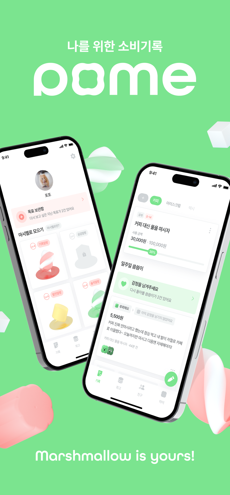
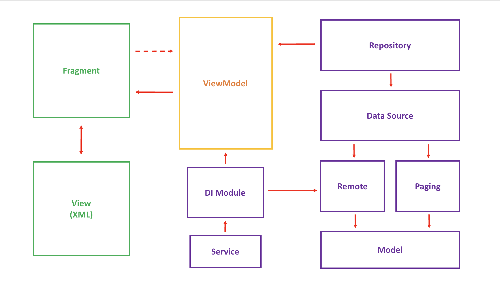

<h1 align="center"> 나를 위한 소비기록 POME </h1>

  
  

🗡️ Pome은 건전한 소비습관을 장려하는 앱입니다.

## 목차

## Download

## Tech stack & Open-source libraries

## Architecture

<h3 align="center"> Pome App Architecture </h3>

## Issue

## Future work

## 현재 안드로이드 기술 흐름
- MVI 패턴
- Compose
- Modularization
- TDD (JUnit, Esspresso)
- Coroutine + Flow
- Kotlin-dsl
- Data 중심 View -> State 중심 View
- CI / CD